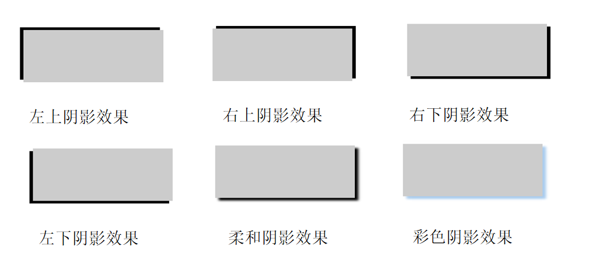
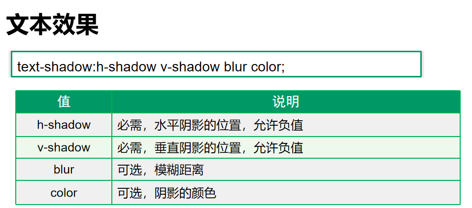

## 1. CSS3概述 （CSS LEVEL 3）

1. 什么是 `CSS3`

   - 在 `CSS2` （从 2002 年 8 月到 2011 年 6 月） 的基础上拓展、新增的样式

   - **CSS3** （2011年6月以后）是*层叠样式表（Cascading Style Sheets）*语言的最新版本，旨在扩展CSS2.1。

     它带来了许多期待已久的新特性， 例如圆角border-radius、阴影box-shawdow、gradients(渐变)、transitions(过渡)与 animations(动画)。以及新的布局方式，如flexible box （弹性盒子布局）与 grid layouts（网格布局）。
     
   - 参考阅读：MDN上关于CSS3的详细介绍https://developer.mozilla.org/zh-CN/docs/Archive/CSS3

2. `CSS3` 发展现状

   - 移动端支持优于 `PC` 端（老的浏览器存在着兼容性问题）
   - `CSS3` 目前还在不断改进中，不断还有新特性被引入。

## 2. CSS3新增选择器

### 2.1 `CSS3 ` 属性选择器

(HTML标签中的)属性选择器列表


属性选择器代码演示

```css
button {
  cursor: pointer;
}
button[disabled] {
  cursor: default
}

input[type=search] {
  color: skyblue;
}

span[class^=black] {
  color: lightgreen;
}

span[class$=black] {
  color: lightsalmon;
}

span[class*=black] {
  color: lightseagreen;
}
```


### 2.2 `CSS3`结构伪类选择器

#### 属性列表


   

#### 代码演示

```css
ul li:first-child {
  background-color: lightseagreen;
}

ul li:last-child {
  background-color: lightcoral;
}

ul li:nth-child(3) {
  background-color: aqua;
}
```

#### `nth-child` 参数详解

1. nth-child 详解

   - 注意：本质上就是选中第几个子元素

   - n 可以是数字、关键字、公式

   - n 如果是数字，就是选中第几个

   - 常见的关键字有 `even` 偶数、`odd` 奇数

   - 常见的公式如下(如果 n 是公式，则从 0 开始计算)

   - 但是第 0 个元素或者超出了元素的个数会被忽略

        

   

2.  代码演示

   ```css
   <style>
     /* 偶数 */
     ul li:nth-child(even) {
       background-color: aquamarine;
     }
   
     /* 奇数 */
     ul li:nth-child(odd) {
       background-color: blueviolet;
     }
   
     /*n 是公式，从 0 开始计算 */
     ul li:nth-child(n) {
       background-color: lightcoral;
     }
   
     /* 偶数 */
     ul li:nth-child(2n) {
       background-color: lightskyblue;
     }
   
     /* 奇数 */
     ul li:nth-child(2n + 1) {
       background-color: lightsalmon;
     }
   
     /* 选择第 0 5 10 15, 应该怎么选 */
     ul li:nth-child(5n) {
       background-color: orangered;
     }
   
     /* n + 5 就是从第5个开始往后选择 */
     ul li:nth-child(n + 5) {
       background-color: peru;
     }
   </style>
   ```

#### `nth-child` 和  `nth-of-type` 的区别

1.  代码演示

   ```css
   <style>
     div :nth-child(1) {
       background-color: lightblue;
     }
   
     div :nth-child(2) {
       background-color: lightpink;
     }
   
     div span:nth-of-type(2) {
       background-color: lightseagreen;
     }
   
     div span:nth-of-type(3) {
       background-color: #fff;
     }
   </style>
   ```


2. 区别

   - `nth-child`  选择父元素里面的第几个子元素，不管是第几个类型
   - `nth-of-type`  选择指定类型的元素

### 2.3 伪元素选择器

1. 伪元素选择器

     

     

2. 伪类选择器__注意事项__

   - `before` 和 `after` 必须有 `content` 属性
   - `before` 在内容前面，after 在内容后面
   - `before` 和 `after` 创建的是一个元素，但是属于行内元素
   - 创建出来的元素在 `Dom` (HTML结构)中查找不到，所以称为伪元素
   - 伪元素和标签选择器一样，权重为 1

3. 代码演示

   ```css
   <style>
       div {
         width: 100px;
         height: 100px;
         border: 1px solid lightcoral;
       }
   
       div::after,
       div::before {
         width: 20px;
         height: 50px;
         text-align: center;
         display: inline-block;
       }
       div::after {
         content: '德';
         background-color: lightskyblue;
       }
   
       div::before {
         content: '道';
         background-color: mediumaquamarine;
       }
     </style>
   ```

#### 伪元素的案例

1. 添加字体图标

   ```css
   p {
      width: 220px;
      height: 22px;
      border: 1px solid lightseagreen;
      margin: 60px;
      position: relative;
   }
   p::after {
     content: '\ea50';
     font-family: 'iconfont';
     position: absolute;
     top: -1px;
     right: 10px;
   }
   ```


## 3.圆角边框(CSS3)

- 语法：

```css
border-radius:length;  
```

- 其中每一个值可以为 数值或百分比的形式。 

- 技巧： 让一个正方形  变成圆圈 

  ~~~
  border-radius: 50%;
  ~~~


## 4. 盒子阴影(CSS3)


- 语法:

~~~css
box-shadow:水平阴影 垂直阴影 模糊距离（虚实）  阴影尺寸（影子大小）  阴影颜色  内/外阴影；
~~~

- 前两个属性是必须写的。其余的可以省略。
- 外阴影 (outset) 是默认的 但是不能写           想要内阴影可以写  inset 

~~~css
div {
			width: 200px;
			height: 200px;
			border: 10px solid red;
			/* box-shadow: 5px 5px 3px 4px rgba(0, 0, 0, .4);  */
			/* box-shadow:水平位置 垂直位置 模糊距离 阴影尺寸（影子大小） 阴影颜色  内/外阴影； */
			box-shadow: 0 15px 30px  rgba(0, 0, 0, .4);
			
}
~~~




